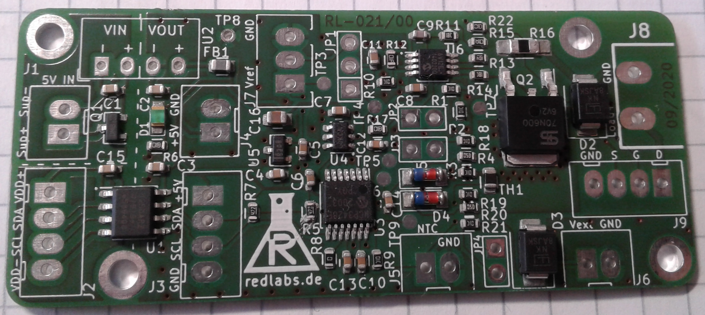

# Digtial DC Load Project




**key features:**
- linear constant curren cink
- galvanic isolated
- selectable operating range
- controlled via I2C
	- write & read load current
	- read load voltage
	- read additional external voltage
	- read temperature 
- option to set current via external voltage

**example application:**
- charge / discharge battery (control & measure current and voltage)
- measure & log current/voltage (use example setup to send data to PC)
- stess test of power supply


## Repository Overview
- **documentation**
  - application notes for constant current sink 
  - block diagram of PCB
  - screenshots and pictures of this project
- **firmware**
  - Arduino Example Project `DigitalLoadExample`, inlcuding a C++ class `RL021_DigitalLoad` for easy control
  - Example calibration procedure (manually step by step)
- **hardware**
  - **KiCAD** Project Folder including schematic, PCB layout and BOM
  - **schematic** and fabrication layer drawing as PDF
  - **datasheet** of used components
- **ui**
  - **GUI_CSS** is an example project for a simple pc-based user interface (written in processing)


## Hardware


**Order PCB:** https://aisler.net/p/YHESFYKF

### Jumper Settings
Via multiple jumpers the used operating ranges can be configured.

| Parameter | Jumper | open | closed |
| -- | -- | -- | -- |
| Current Control | JP1 | External analog signal | Digital via onboard DAC |
| I_load range | JP2 | low 0-1A | high 0-10A |
| V_load range | JP3 | high 0-24V | 0-4V |
| V_extern range | JP4 | high 0-24V | 0-4V |
| ADC I2C Addr (A2,A1,A0)| R8 | 0,0,1 | 0,0,0 |

# Example Setup


## Example Arduino Control

### Connect Arduino to CCS-PCB
| Signal      	| Arduino Pin    |
|---------------|-------|
| I2C_VDD (J2, pin1)    	| 5V 	|
| I2C_SDA (J2, pin2) 		| A4    |
| I2C_SCL (J2, pin3)    	| A5 	|
| I2C_GND (J2, pin4)    	| GND 	|
| SUPPLY_+5V (J1, pin1)    	| 5V 	|
| SUPPLY_GND (J1, pin2)    	| GND 	|

### Configure CCS-PCB according to your application
- See chapter "Jumper Settings" to select your operating range
- In the Arduino Code, the settings should be set according to physical state of the jumpers:
	```
		/// Write board jumper settings (like set on PCB)
		myLoad.SetJumperSetting(JP2_CURRENT,Jumper_Closed);
		myLoad.SetJumperSetting(JP3_VLOAD,Jumper_Open);
		myLoad.SetJumperSetting(JP4_VEXT,Jumper_Open);  
	```


## Example User Interface
An example PC-based user interface (written in "Processing"), for the use with the `firmware/DigitalLoadExample` project.

### Connect UI to Arduino ###
- The UI communicates via serial comport using simple ASCII character commands, so the communication could also be done manual.  
- The UI uses the first found COMPORT (to use another port, change this in the processing code)
	````
	  String portName = Serial.list()[0];
	  myPort = new Serial(this, portName, 115200);
	````
### Usage ###
In the "Control" page, all measured values are displayed in SI-units. The user can set the desired load current in mA.


In the "Calibration" page, the raw ADC values are displayed. The user can set the raw DAC value.


... find other projects: https://redlabs.de/